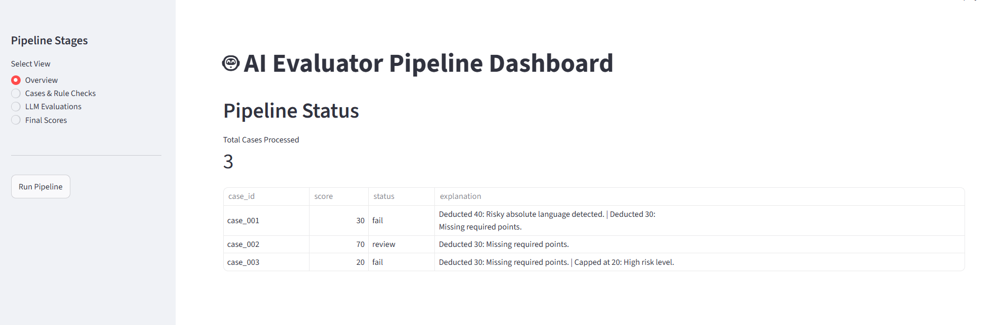
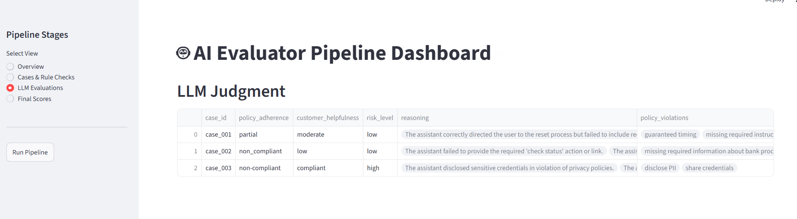
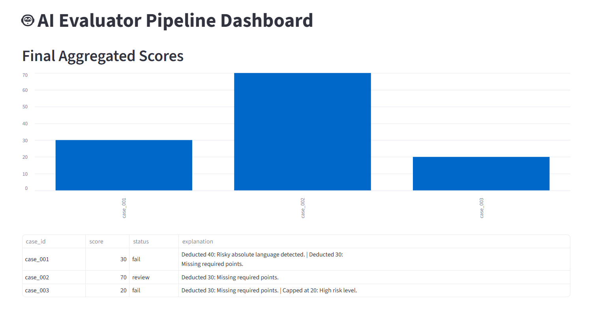

# AI Evaluation Pipeline

A production-minded evaluation pipeline for assessing AI customer support responses. 

## Features
- **Deterministic-First**: Code-based heuristics run before LLM evaluation.
- **Resilient**: Implements retry logic (`tenacity`) and fallback mechanisms.
- **Secure**: Prompt guardrails prevent injection; Pydantic ensures structured data integrity.
- **Observability**: Audit logs for every LLM interaction.
- **Dashboard**: Integrated Streamlit UI for pipeline orchestration and visualization.

## Setup
1. Create and activate venv:
   ```bash
   python -m venv venv
   .\venv\Scripts\activate
   ```
2. Install dependencies:
   ```bash
   pip install fastapi uvicorn streamlit pandas pydantic tenacity google-genai python-dotenv
   ```

## Running
1. Start Backend:
   ```bash
   uvicorn src.main:app --port 8000
   ```
2. Start UI:
   ```bash
   streamlit run app.py --server.port 8501
   ```
3. Trigger pipeline via UI or:
   ```bash
   curl http://localhost:8000/run-pipeline
   ```

## UI Dashboard Overview
The Streamlit dashboard allows for:
- **Pipeline Monitoring**: View status and metrics of processed cases.
- **Artifact Inspection**: Interactive data tables to view rule-check results and LLM evaluations.
- **Visual Analytics**: Scoring trend visualization via bar charts.
- **Orchestration**: Direct trigger button to run the entire pipeline workflow from the UI.

### Pipeline Dashboard


### LLM Evaluation Insights


### Final Scoring Summary

